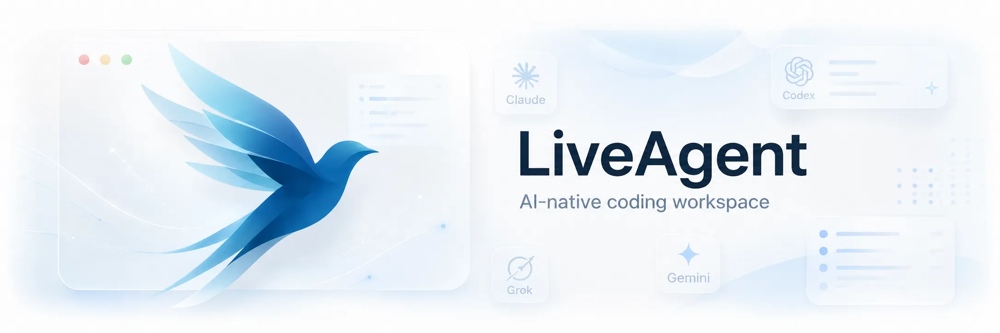
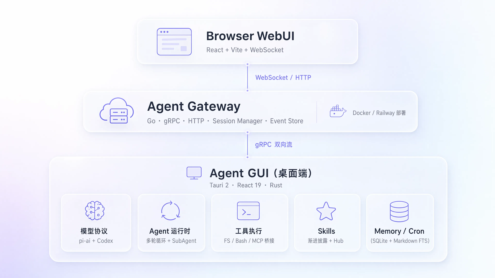
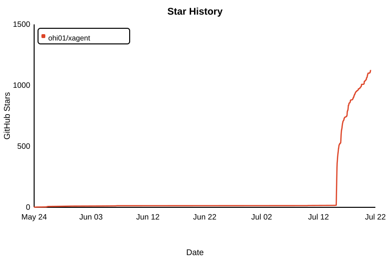

<p align="center">
  
</p>

<h1 align="center">XAgent</h1>

<p align="center">
  <strong>Your Local-First AI Agent Desktop</strong><br/>
  多模型接入 · 本地工具执行 · MCP & Skills · Web/PC/移动端
</p>

<p align="center">
  <a href="README.md">English</a> | 简体中文
</p>

<p align="center">
  
  
  
  
  
</p>

<p align="center">
  <a href="#核心能力">核心能力</a> •
  <a href="#下载与部署">下载与部署</a> •
  <a href="#faq">FAQ</a> •
  <a href="docs/">文档</a>
</p>

---

## 🌟 特别鸣谢

<p align="center">
  <a href="https://linux.do">
    
  </a>
</p>
<p align="center"><b>学AI，上L站！祝小破站越来越好～</b></p>

---

## ❤️ 赞助商

<table>
<tr>
<td width="200" align="center" valign="middle"><a href="https://www.packyapi.com/register"></a></td>
<td valign="middle">PackyCode 是一家稳定、高效、专业的API中转服务商，提供 Claude Code、Codex、Gemini，国模 等多种中转服务，老牌顶级中转，<b>开发本软件用的绝大多数模型资源都是PackyCode提供，感谢老农！</b>从 <a href="https://www.packyapi.com/register">此处</a> 注册并开始使用！ </td>
</tr>
<tr>
<td width="200" align="center" valign="middle"><a href="https://www.right.codes/register"></a></td>
<td valign="middle">Right Code 提供稳定的 Claude Code、Codex、Gemini，国模 等模型的中转服务。充值即可开票，企业、团队用户一对一对接。<b>开发本软件用的另一部分模型资源都是RightCode提供，感谢RC站长，感谢小客服！</b> 从 <a href="https://www.right.codes/register">此处</a> 注册并开始使用！</td>
</tr>
<tr>
<td width="200" align="center" valign="middle"><a href="https://cubence.com/signup"></a></td>
<td valign="middle">Cubence 是一家可靠高效的 API 中转服务商，提供 Claude Code、Codex、Gemini 等多种模型的中转服务，支持按量付费的计费方式。<b>感谢 Cubence 对本项目的支持！</b>从 <a href="https://cubence.com/signup">此处</a> 注册并开始使用！</td>
</tr>
</table>


---

## 🤝 一起来开发吧！

<p align="center">
  
</p>

<p align="center">
  欢迎扫码进群，一起推进 XAgent 的开发！<br/>
  （至于为什么是QQ群，感觉功能比微信群多一些～）
</p>


---

## 为什么是 XAgent?

XAgent 是一个覆盖 Web、桌面和移动端的 **本地优先** AI Agent。它将大语言模型推理与本地系统工具深度整合，让 AI 能够操作文件、执行命令、调用 MCP 与 Skills，并管理定时任务。

- **真正动手的 Agent** — 不止于对话:读写文件、精确编辑、执行 Bash、托管长驻进程
- **生态完全开放** — MCP 协议桥接任意外部工具,Skills 技能包按需加载
- **一套前端覆盖全部平台** — 同一份 React/Tauri 源码运行于 Web、macOS、Windows、Linux、Android 与 iOS
- **局域网控制与便携执行** — 通过 `28367` 端口让浏览器或手机配对桌面端；电脑不可用时可选择移动端或 GitHub Actions 执行环境

---

## 核心能力


### 🧠 多模型与对话

- **多模型路由** — Claude(Anthropic)与 Codex(OpenAI)、Gemini 三协议,支持自定义 Base URL 接入第三方兼容服务
- **富文本渲染** — Markdown 流式渲染,内建 KaTeX 公式、Mermaid 图表与 Monaco 代码预览
- **历史压缩** — Segment + Summary Checkpoint 双层持久化,长对话不丢上下文
- **国际化** — 内建 i18n 多语言框架

### 🔧 本地工具执行

- **文件系统全能力** — `Read` / `Write` / `Edit` / `Delete` 精确读写,`Glob` / `Grep` 模式与正则搜索
- **Bash 与长驻进程** — 非交互式命令执行(cwd / timeout),`ManagedProcess` 托管 dev server 等常驻任务
- **Sub-Agent 委派** — 独立子代理并行执行,worktree 隔离,自动合并
- **跨平台执行后端** — 桌面系统工具、Android PRoot、iOS a-Shell 与可选 GitHub Actions 共用同一能力模型

### 🧩 MCP 与 Skills 生态

- **MCP 协议桥接** — Tauri 端原生桥接任意 stdio / http MCP Server,无限扩展工具能力
- **Skills 技能包** — 渐进式披露、按需加载,支持安装 / 创建 / 打包与 ClawHub 生态

### 💾 记忆与自动化

- **持久化记忆** — Markdown + SQLite FTS 全文检索,跨会话知识管理
- **定时任务** — bash / http / prompt 三种 Cron 任务类型,后台自动执行

### 🌐 本地 WebUI 与移动端

- **局域网配对访问** — 在桌面端设置中开启 WebUI，从其他设备打开 `http://<电脑IP>:28367`
- **无需第二套前端或服务端部署** — Tauri 桌面端直接托管同一份 React 应用，并暴露经过认证和权限控制的本地 API
- **移动端独立模式** — Android 与 iOS 可执行其支持的本地任务；明确启用云端执行后可生成跨平台产物

---

## 下载与部署

安装包由 GitHub Actions 自动构建并发布,请前往 [**GitHub Releases**](https://github.com/oliid0/xgent/releases/latest) 获取最新版本。Release 是否带 Developer ID/公证以该版本说明为准；无证书版本同样可以安装。

### 系统要求

| 平台 | 要求 |
|---|---|
| macOS | Intel(x64)与 Apple Silicon(aarch64)双架构 |
| Windows | x64,需 WebView2 运行时(Windows 11 已内置) |
| Linux | x86_64,需 WebKitGTK 4.1(Ubuntu 22.04+ / Debian 12+ 等) |
| Android | arm64 或 x86_64；可选 PRoot 环境在首次使用时准备 |
| iOS / iPadOS | arm64；未签名 IPA 安装前需要重新签名 |

### macOS 用户

从 [Releases](https://github.com/oliid0/xgent/releases/latest) 下载对应芯片的 DMG,打开后将 XAgent 拖入「应用程序」:

- Apple Silicon(M 系列):`XAgent-<版本>-macOS-aarch64.dmg`
- Intel:`XAgent-<版本>-macOS-x64.dmg`

> 无 Developer ID 的版本首次打开时，macOS 会阻止直接启动。请在 Finder 中按住 Control 点击 XAgent 并选择“打开”，或前往“系统设置 → 隐私与安全性”选择仍要打开；授权后可正常使用。带签名/公证的版本不需要此操作。

### Windows 用户

从 [Releases](https://github.com/oliid0/xgent/releases/latest) 按需选择一种安装方式:

| 方式 | 文件 | 适合 |
|---|---|---|
| 安装向导 | `XAgent-<版本>-Windows-x64-Setup.exe` | 大多数用户 |
| MSI 包 | `XAgent-<版本>-Windows-x64.msi` | 企业分发 / 静默安装 |
| 便携版 | `XAgent-<版本>-Windows-x64-portable.zip` | 免安装,解压即用 |

### Linux 用户

从 [Releases](https://github.com/oliid0/xgent/releases/latest) 按发行版选择:

| 格式 | 适用发行版 | 安装方式 |
|---|---|---|
| AppImage | 任意发行版 | `chmod +x` 后直接运行 |
| DEB | Debian / Ubuntu 系 | `sudo dpkg -i XAgent-<版本>-Linux-x86_64.deb` |
| RPM | Fedora / openSUSE 系 | `sudo rpm -i XAgent-<版本>-Linux-x86_64.rpm` |

### 在局域网使用 WebUI

1. 在桌面客户端打开 **设置 → 访问**。
2. 开启 **WebUI**，保留默认端口 `28367`，并选择局域网或仅本机范围。
3. 生成六位配对码。
4. 在手机、平板或其他浏览器打开界面显示的地址并输入配对码。

桌面客户端需要保持运行。配对会话可以随时撤销，终端、SSH、Git 和文件写入分别受权限开关控制，模型、SSH 与 GitHub 凭据不会返回到浏览器。普通 HTTP 仅适合可信局域网。


### 从源码构建

展开下方「开发指南」查看完整 Make 命令。



<details>
<summary><b>架构总览</b> — 架构图与技术栈</summary>

```
┌──────────────────────────────────────────────────────────────┐
│               XAgent 统一 React 前端源码                      │
│              Web · 桌面端 · Android · iOS                    │
└────────────────────────────┬─────────────────────────────────┘
                             │ Tauri IPC 或配对 HTTP/SSE
┌────────────────────────────▼─────────────────────────────────┐
│                    Tauri 2 系统运行时                         │
│                         Rust                                 │
├──────────┬───────────┬───────────┬───────────┬───────────────┤
│ 模型协议  │ Agent运行时 │  工具执行   │  Skills   │  Memory/Cron  │
│ pi-ai    │ 多轮循环   │ FS/Bash/  │  渐进披露  │  SQLite+MD    │
│ + Codex  │ + SubAgent │ MCP桥接   │  + Hub    │  FTS索引      │
└──────────┴───────────┴───────────┴───────────┴───────────────┘
                             │ 可选执行后端
              ┌──────────────┼──────────────┐
              ▼              ▼              ▼
        Android PRoot    iOS a-Shell   GitHub Actions
```

**技术栈**

| 组件 | 技术 |
|---|---|
| **统一前端** · 框架 | Tauri 2 + React 19 + TypeScript 7 |
| **统一前端** · 构建 | Vite 8 + pnpm(Web/PC/移动端共享源码) |
| **统一前端** · 样式 | Tailwind CSS 4 + Base UI |
| **统一前端** · 渲染 | streamdown + KaTeX + Mermaid + Monaco Editor |
| **Tauri** · 后端 | Rust + Tokio + SQLite (rusqlite) + 本地 Axum WebUI |
| **Agent** · LLM | @earendil-works/pi-ai |
| **移动端执行** | Android PRoot + Alpine；iOS a-Shell 命令运行时 |
| **云端执行** | 用户自有公开 `agent-temp` 仓库 + GitHub Actions |

</details>

<details>
<summary><b>开发指南</b> — 常用 Make 命令(完整列表见 <code>make help</code>)</summary>

| 命令 | 说明 |
|---|---|
| `make dev` | 启动 Tauri 开发环境 |
| `make build` | 构建桌面应用 |
| `make dev-web` | 从统一前端源码启动 Web 开发服务 |
| `make web` | 从统一前端源码构建 Web 静态文件 |
| `make desktop-build-macos-release` | macOS 签名发布构建 |
| `make clean` | 清理构建产物 |

</details>

<details>
<summary><b>项目结构</b> — 目录树</summary>

```
XAgent/
├── crates/
│   ├── fronted/                  # Web/PC/移动端统一应用
│   │   ├── src/                  # React 前端
│   │   │   ├── components/       #   UI 组件
│   │   │   ├── lib/              #   核心逻辑 (chat, tools, skills, memory)
│   │   │   ├── pages/            #   页面 (Chat, Settings)
│   │   │   ├── i18n/             #   国际化
│   │   │   └── prompt/           #   System Prompt 模板
│   │   └── src-tauri/            # Rust 后端 (Tauri)
│   │
│   └── mobile-execution/         # Android PRoot 与 iOS a-Shell 插件
│
├── docs/                         # 项目文档
│   ├── architecture/             #   架构设计
│   ├── features/                 #   功能说明
│   └── operations/               #   运维部署
│
├── scripts/release/              # 发布自动化
├── .github/workflows/            # CI/CD (CI + Desktop Release)
├── Makefile                      # 构建命令集
└── Cargo.toml                    # Rust workspace
```

</details>

---

## FAQ

<details>
<summary><b>API Key 会离开本机吗?</b></summary>

不会。模型与 SSH 凭据保留在原生宿主中，配对浏览器只会收到脱敏设置并通过本地认证代理访问模型。云端执行使用的 GitHub PAT 保存在原生加密保险库中。

</details>

<details>
<summary><b>浏览器访问需要部署服务端吗?</b></summary>

不需要。在桌面客户端开启 WebUI 后，内置 Tauri 服务会在 `28367` 端口托管同一份 React 前端。

</details>

<details>
<summary><b>支持哪些模型?</b></summary>

内置 Claude(Anthropic) 与 Codex(OpenAI)、Gemini 三协议,并支持自定义 Base URL 接入任何兼容的第三方服务。

</details>

<details>
<summary><b>长对话 / 断线后上下文会丢吗?</b></summary>

不会。原生宿主以 Segment + Summary Checkpoint 持久化完整历史；配对客户端读取同一份 SQLite 历史并订阅允许的运行事件。

</details>

---

## 贡献

欢迎提交 Issue 与 Pull Request!开发环境搭建请参考 [开发指南](docs/operations/development.md)。

提交 PR 前,请确保以下检查全部通过(与 CI 门禁一致):

**桌面客户端 · `crates/fronted`**

1. 类型检查与构建通过:`pnpm build`
2. 代码规范检查通过:`pnpm lint`
3. 前端单元测试通过:`pnpm test:frontend`(改动发布脚本时另跑 `pnpm test:release`)
4. Rust 后端检查通过:`cargo check --manifest-path crates/fronted/src-tauri/Cargo.toml --tests`(仓库根目录执行)

**单前端边界**

- Web/PC/移动端都从 `crates/fronted` 构建,平台差异只允许进入 `src/runtime` 或 Tauri 系统边界。
- 本地浏览器访问由 Tauri 宿主负责，不得新增第二套前端或独立网关。
- 保持 diff 干净 (无行尾空白):`git diff --check`

---

## 👥 贡献者

感谢所有为 XAgent 做出贡献的朋友们！

<a href="https://github.com/oliid0/xgent/graphs/contributors">
  
</a>

---

## Star History

<a href="https://www.star-history.com/?repos=oliid0%2Fxgent&type=date&legend=top-left">

 <picture>
   <source media="(prefers-color-scheme: dark)" srcset="docs/images/star-history-dark.svg" />
   <source media="(prefers-color-scheme: light)" srcset="docs/images/star-history-light.svg" />
   
 </picture>
</a>

---

## License

MIT © Oliid0
